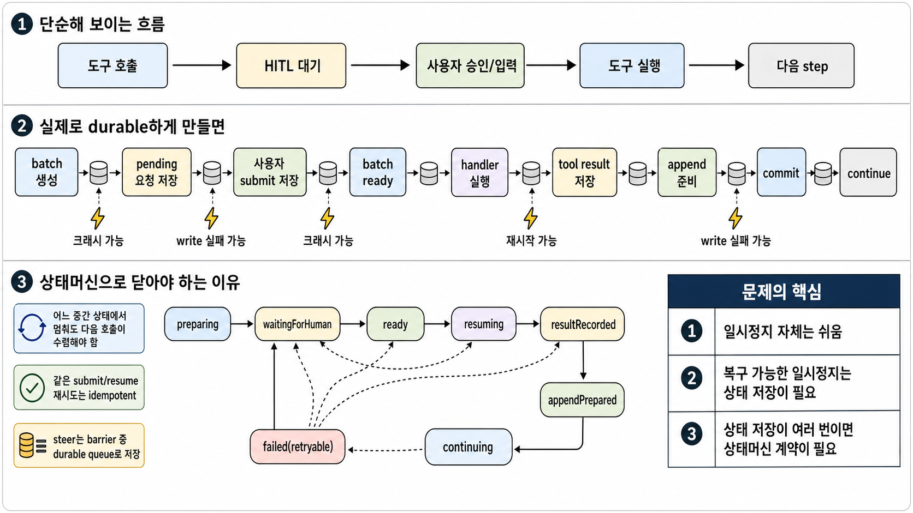

# hitl - Human-in-the-loop durable tool approval

## 1. Outcome Statement

OpenHarness는 사람이 승인하거나 값을 보완해야 하는 tool call을 conversation 단위 barrier로 보류하고, pending 이후의 human result와 queued steer를 durable하게 보존한 뒤 같은 batch를 기준으로 재개한다.

## 2. Desired State

LLM이 한 step에서 여러 tool call을 반환했을 때, 그중 하나라도 HITL이 필요하면 해당 step의 tool call 전체가 하나의 `HitlBatch`가 된다.

- HITL이 필요하지 않은 tool call은 즉시 실행되고, 그 tool result는 batch record에 저장된다.
- HITL이 필요한 tool call은 handler 실행 전 `HitlRequest`로 저장되고 `pending` 상태로 노출된다.
- batch 안의 모든 HITL request가 submit될 때까지 다음 LLM step은 실행되지 않는다.
- pending batch가 있는 동안 같은 conversation으로 들어온 ingress/steer는 새 turn을 시작하지 않고 durable queue에 저장된다.
- 마지막 request가 submit되면 batch는 `ready`가 되고, resume은 저장된 normal tool result, human result, queued steer를 사용해 다음 step을 실행한다.

이 스펙의 핵심은 "무기한 메모리 대기"가 아니라 "pending 이후 복구 가능한 중단점"을 만드는 것이다.



## 3. Scope Boundary

### 3.1 Committed Guarantees

- `batchId`와 `requestId`는 `turnId`, `stepNumber`, `toolCallId`에서 파생하지 않는 opaque generated ID다.
- HITL handler는 human result가 저장되기 전에는 실행되지 않는다.
- `waitingForHuman`으로 관찰되는 batch는 batch, request, 같은 step의 non-HITL tool result가 모두 durable store에 저장된 상태다.
- human result submit은 즉시 durable store에 저장된다.
- 같은 request에 대한 submit 재시도는 idempotent하게 같은 결과로 수렴한다.
- 같은 batch의 모든 request가 submit되기 전에는 resume을 시작하지 않는다.
- pending HITL 중 들어온 ingress/steer는 durable queue에 저장되거나, 저장할 수 없으면 accepted로 반환되지 않는다.
- direct `processTurn()`과 direct `steerTurn()`도 pending HITL barrier를 우회해 새 LLM step을 시작하면 안 된다.
- resume 재시도는 이미 저장된 human result와 queued steer를 유실하지 않아야 한다.
- runtime 재시작 후 `waitingForHuman`, `ready`, retryable resume 상태는 조회 또는 재개 가능해야 한다.

### 3.2 Explicit Non-goals

- OpenHarness core는 외부 tool handler side effect의 exactly-once 실행을 보장하지 않는다.
- handler가 시작된 뒤 프로세스가 죽은 경우 core는 해당 handler를 자동 재실행하지 않는다.
- `HitlStore` 메서드 내부의 partial write까지 runtime이 복구하지 않는다. store 메서드 하나는 atomic하다는 계약을 가진다.
- in-memory `HitlStore`는 프로세스 크래시 후 durability를 보장하지 않는다. durable recovery는 durable adapter의 책임이다.
- 여러 runtime/process가 동시에 같은 conversation을 처리하는 완전한 분산 lock/fencing은 이번 core scope가 아니다.
- conversation event store가 durable/idempotent하지 않은 환경에서 append 이후 프로세스 크래시까지 완전 복구하는 것은 보장하지 않는다.
- 장시간 pending 동안 `processTurn()` Promise를 계속 유지하는 것은 기본 모델이 아니다.
- TTL, reminder, escalation, approval UI, CLI UX는 core HITL 계약 밖의 확장 영역이다.

## 4. Glossary

| 용어 | 정의 |
| --- | --- |
| HITL | Human In The Loop. 도구 실행 전 사람의 승인, 거절, 텍스트, form 입력을 요구하는 흐름 |
| HitlBatch | 한 LLM step에서 반환된 tool call 전체를 묶는 durable barrier |
| HitlRequest | batch 안의 HITL 대상 tool call 하나에 대한 pending approval/input record |
| Human Result | 사람이 제출한 approve/reject/text/form payload |
| Queued Steer | pending HITL batch가 있는 동안 같은 conversation으로 들어와 durable queue에 저장된 입력 |
| Resume | ready batch를 복원해 tool results와 queued steer를 append하고 continuation step을 실행하는 행위 |
| Atomic Store Method | 성공하면 관련 상태가 모두 반영되고, 실패하면 호출 전 상태로 남는 `HitlStore` 메서드 |

## 5. Requirements

### 5.1 Functional Requirements

| ID | Level | Requirement |
| --- | --- | --- |
| FR-HITL-001 | Committed | `ToolDefinition`은 선택적으로 HITL policy를 선언할 수 있어야 한다. |
| FR-HITL-002 | Committed | HITL 대상 tool call은 handler 실행 전에 `HitlRequest`로 durable 저장되어야 한다. |
| FR-HITL-003 | Committed | 한 step에 여러 HITL tool call이 있으면 하나의 batch 안에 여러 request로 저장되어야 한다. |
| FR-HITL-004 | Committed | 같은 step의 non-HITL tool call은 실행되고 그 결과가 batch record에 저장되어야 한다. |
| FR-HITL-005 | Committed | batch의 모든 HITL request가 submit되기 전에는 continuation step을 실행하면 안 된다. |
| FR-HITL-006 | Committed | pending batch/request 조회 API를 제공해야 한다. |
| FR-HITL-007 | Committed | human result submit API를 제공해야 한다. |
| FR-HITL-008 | Committed | approve/text/form result는 handler 실행에 필요한 final args를 만들 수 있어야 한다. |
| FR-HITL-009 | Committed | reject result는 handler 호출 없이 rejection tool result로 완료되어야 한다. |
| FR-HITL-010 | Committed | pending HITL 중 ingress/steer는 durable queue에 저장되어야 한다. |
| FR-HITL-011 | Committed | resume은 tool-result flush 후 queued steer를 drain하고 continuation step 전에 반영해야 한다. |
| FR-HITL-012 | Committed | runtime 재시작 후 pending/ready/retryable batch를 조회 또는 재개할 수 있어야 한다. |
| FR-HITL-013 | Committed | HITL lifecycle은 runtime event로 관찰 가능해야 한다. |
| FR-HITL-014 | Planned | TTL, reminder, cancel policy는 extension으로 추가 가능해야 한다. |
| FR-HITL-015 | Candidate | CLI는 pending 조회와 submit/resume 명령을 제공할 수 있다. |

### 5.2 Non-functional Requirements

| ID | Level | Requirement |
| --- | --- | --- |
| NFR-HITL-001 | Committed | Durable-before-observable: pending event와 waiting result는 durable store write 이후에만 발행된다. |
| NFR-HITL-002 | Committed | Submit idempotency: 같은 request/result/idempotency key 재시도는 중복 mutation을 만들지 않는다. |
| NFR-HITL-003 | Committed | Recoverability: durable store가 있으면 pending/ready/retryable batch는 runtime 재생성 후 복구 가능하다. |
| NFR-HITL-004 | Committed | Ordering: batch tool results는 `toolCallIndex` 순서로 append된다. |
| NFR-HITL-005 | Committed | Compatibility: HITL 미사용 tool flow는 기존 동작을 유지한다. |
| NFR-HITL-006 | Committed | Scope safety: submit은 request identity와 optional `agentName`/`conversationId` guard를 검증한다. |

## 6. Behavior Specification

### 6.1 Flow: HITL batch creation

**ID:** `HITL-BATCH-01`

**Trigger:** LLM step response가 하나 이상의 tool call을 포함한다.

**Main Flow:**

1. runtime은 step의 모든 tool call에 대해 HITL policy를 평가한다.
2. HITL 대상 tool call이 없으면 기존 tool execution flow를 그대로 사용한다.
3. HITL 대상 tool call이 하나 이상 있으면 runtime은 opaque `batchId`와 request별 opaque `requestId`를 생성한다.
4. runtime은 `HitlStore.createBatch()`를 호출해 batch와 request들을 atomic하게 저장한다.
5. runtime은 non-HITL tool call을 실행하고 결과를 batch record에 저장한다.
6. 모든 non-HITL result가 저장되면 runtime은 `HitlStore.markWaitingForHuman()`을 호출한다.
7. 같은 step 실행 중 active turn에 들어온 steered input은 batch의 durable queued steer로 이동한다.
8. batch가 `waitingForHuman`이 된 뒤 `hitl.batch.requested`와 `hitl.requested` 이벤트를 발행한다.
9. current turn은 `waitingForHuman`으로 settle한다.

**Failure Handling:**

- `createBatch()` 실패 시 어떤 tool handler도 호출하지 않고 turn은 error로 종료한다.
- non-HITL handler 시작 전 실패는 turn error 또는 batch failed로 처리할 수 있다.
- non-HITL handler 시작 후 실패/크래시는 자동 재실행하지 않는다. store에 남은 상태를 기준으로 operator recovery 또는 failed 상태로 남긴다.
- `preparing` 상태는 pending UI/API 또는 durable steer queue 대상으로 노출되는 안정 상태가 아니다. startup recovery는 안전하게 완료할 수 없는 `preparing` batch를 `failed`, `blocked`, 또는 `canceled`로 수렴시킬 수 있다.

### 6.2 Flow: pending HITL query

**ID:** `HITL-LIST-01`

**Trigger:** host/UI/connector가 pending HITL을 조회한다.

**Main Flow:**

1. runtime은 filter를 검증한다.
2. runtime은 `waitingForHuman` batch와 `pending` request를 store에서 조회한다.
3. runtime은 request별 prompt, response schema, submitted state, batch identity를 반환한다.

**Guarantee:**

- `preparing` batch는 pending approval 대상으로 반환하지 않는다.
- `waitingForHuman` batch는 submit 가능한 stable state다.

### 6.3 Flow: human result submit

**ID:** `HITL-SUBMIT-01`

**Trigger:** `submitHitlResult(input)`

**Main Flow:**

1. runtime은 request를 조회하고 optional `agentName`/`conversationId` guard를 검증한다.
2. runtime은 result payload를 response schema에 맞게 검증한다.
3. runtime은 `HitlStore.submitRequestResult()`를 호출한다.
4. `submitRequestResult()`는 다음을 하나의 atomic store method로 처리한다.
   - request result 저장
   - duplicate submit 감지
   - 남은 pending peer 계산
   - 마지막 peer였다면 owning batch를 `ready`로 전환
5. runtime은 저장 결과에 따라 `hitl.resolved`, `hitl.rejected`, `hitl.batch.ready` 이벤트를 발행한다.
6. batch가 `ready`이면 runtime은 resume task를 schedule한다.

**Outputs:**

```ts
type SubmitHitlResult =
  | { status: "accepted"; request: HitlRequestView; resume: "waitingForPeers" | "scheduled" }
  | { status: "duplicate"; request: HitlRequestView; resume: "waitingForPeers" | "scheduled" | "alreadyCompleted" }
  | { status: "notFound"; requestId: string }
  | { status: "invalid"; requestId: string; error: string }
  | { status: "error"; requestId: string; error: string };
```

**Failure Handling:**

- validation/scope 실패는 durable state를 바꾸지 않는다.
- store write 실패는 durable state를 바꾸지 않은 것으로 간주한다.
- `request resolved but batch not ready` 같은 partial state는 정상 runtime contract가 아니라 `HitlStore` atomicity 위반이다.

### 6.4 Flow: pending HITL 중 steer/ingress

**ID:** `HITL-STEER-01`

**Trigger:** pending 또는 resume-before-drain batch가 있는 conversation으로 input이 들어온다.

**Main Flow:**

1. runtime/ingress는 active turn보다 먼저 해당 conversation의 queueable HITL batch를 조회한다.
2. queueable batch가 있으면 새 turn을 시작하지 않는다.
3. input을 durable envelope로 만들 수 있으면 `HitlStore.enqueueSteer()`로 저장한다.
4. 저장 성공 후 `queuedForHitl` 또는 equivalent queued result를 반환한다.
5. durable envelope를 만들 수 없거나 queue write가 실패하면 input을 accepted로 반환하지 않는다.
6. `preparing` batch는 queueable batch가 아니다. 같은 conversation에 active turn이 있으면 input은 active turn steering으로 들어가며, 그 turn이 HITL로 settle할 때 durable queued steer로 이동한다.

**Required Paths:**

- ingress dispatch path
- direct `steerTurn()` path
- direct `processTurn()` path

**Guarantee:**

- pending HITL barrier가 있는 conversation에서 새 LLM step이 몰래 시작되면 안 된다.
- queue 저장 실패가 normal steer 또는 new turn fallback으로 바뀌면 안 된다.
- `preparing` batch는 같은 conversation의 중복 batch 생성을 막는 barrier지만, pending user input을 durable queue로 받는 대상은 아니다.

### 6.5 Flow: HITL batch resume

**ID:** `HITL-RESUME-01`

**Trigger:** 마지막 submit 직후 schedule, explicit `resumeHitlBatch(batchId)`, 또는 startup recovery.

**Preconditions:**

- batch status가 `ready` 또는 retryable resume state다.
- 모든 HITL request가 `resolved` 또는 `rejected`다.
- non-HITL tool result가 batch record에 저장되어 있다.

**Main Flow:**

1. runtime은 batch를 `resuming`으로 전환한다.
2. runtime은 `toolCallIndex` 순서로 final tool result set을 만든다.
3. non-HITL tool call은 저장된 result를 사용한다.
4. rejected HITL request는 handler를 호출하지 않고 rejection result를 만든다.
5. approved/text/form HITL request는 final args를 만든 뒤 handler를 실행한다.
6. handler 결과 저장과 request completion은 `HitlStore.completeRequestWithToolResult()` 하나로 atomic하게 처리한다.
7. 모든 result가 준비되면 runtime은 queued steer drain set을 확정한다.
8. runtime은 tool-result messages를 append하고, queued steer를 그 뒤에 append한다.
9. runtime은 `HitlStore.commitResumeAppend()`를 호출해 appended result와 drained steer를 commit한다.
10. runtime은 continuation step을 실행한다.
11. continuation이 settle되면 `HitlStore.completeBatch()`를 호출한다.

**Failure Handling:**

- handler 시작 전 validation/config 실패는 non-retryable failed로 닫을 수 있다.
- handler 시작 후 실패/크래시는 automatic retry 대상이 아니다. batch/request는 `blocked` 또는 non-retryable failed로 남긴다.
- `completeRequestWithToolResult()` 실패 시 handler를 자동 재실행하면 안 된다. store에 completion이 없으면 operator recovery 대상이다.
- `commitResumeAppend()` 실패 시 accepted queued steer는 삭제되거나 drained로 숨겨지면 안 된다. retry 시 같은 queued steer를 다시 반영할 수 있어야 한다.
- `commitResumeAppend()` 성공 후 continuation 실패는 batch를 retryable resume state로 남기거나 failed로 닫는다. 외부 handler는 재실행하지 않는다.

### 6.6 Flow: startup recovery

**ID:** `HITL-RECOVER-01`

**Trigger:** durable HITL store가 configured된 runtime 생성.

**Main Flow:**

1. runtime은 recoverable batch를 조회한다.
2. `waitingForHuman` batch는 pending query와 steer queue 대상으로 노출한다.
3. `ready` batch는 resume task로 schedule한다.
4. resume 도중 실패했지만 external handler 재실행이 필요 없는 retryable batch는 resume task로 schedule한다.
5. `blocked` batch는 자동 resume하지 않는다.
6. `preparing` batch는 안전하게 waiting으로 수렴 가능한 경우에만 복구하고, 아니면 failed/blocked/canceled로 수렴시킨다.

**Guarantee:**

- startup recovery는 pending human result와 queued steer를 잃지 않는다.
- startup recovery는 external handler를 자동 재실행하지 않는다.

## 7. State Model

### 7.1 HitlBatch

```text
preparing
  -> waitingForHuman
  -> ready
  -> resuming
  -> continuing
  -> completed

preparing -> failed | blocked
waitingForHuman -> canceled | expired
ready -> failed(retryable)
resuming -> failed(retryable) | failed(nonRetryable) | blocked
continuing -> failed(retryable) | completed
```

| Status | Meaning |
| --- | --- |
| `preparing` | batch/request는 생성됐지만 pending으로 노출할 안정 지점은 아직 아님 |
| `waitingForHuman` | pending request가 UI/API에 노출되고 submit 가능함 |
| `ready` | 모든 request가 submit되어 resume 가능함 |
| `resuming` | final tool result set 생성과 append가 진행 중임 |
| `continuing` | resume append가 commit되고 continuation step이 진행 중임 |
| `completed` | continuation까지 settle됨 |
| `failed` | 실패함. `failure.retryable`로 재시도 가능 여부를 표현함 |
| `blocked` | external side effect 이후 중단되어 자동 재시도하지 않음 |
| `canceled`/`expired` | 운영 정책으로 닫힘 |

### 7.2 HitlRequest

```text
pending -> resolved -> completed
pending -> rejected -> completed
pending -> canceled | expired
resolved/rejected -> failed | blocked
```

| Status | Meaning |
| --- | --- |
| `pending` | human result 대기 |
| `resolved` | approve/text/form result 저장됨 |
| `rejected` | reject result 저장됨 |
| `completed` | batch resume에서 final tool result가 반영됨 |
| `failed` | request 처리 실패 |
| `blocked` | handler side effect 이후 자동 재시도 불가 |

## 8. Interface Specification

### 8.1 ToolDefinition extension

```ts
interface ToolDefinition {
  name: string;
  description: string;
  parameters: ToolParameters;
  hitl?: HitlPolicy;
  handler: (args: JsonObject, context: ToolContext) => Promise<ToolResult>;
}
```

### 8.2 Runtime control API

```ts
interface ControlApi {
  listPendingHitl(filter?: HitlRequestFilter): Promise<HitlRequestView[]>;
  listPendingHitlBatches(filter?: HitlBatchFilter): Promise<HitlBatchView[]>;
  getHitlBatch(batchId: string): Promise<HitlBatchView | null>;
  getHitlRequest(requestId: string): Promise<HitlRequestView | null>;
  submitHitlResult(input: SubmitHitlResultInput): Promise<SubmitHitlResult>;
  resumeHitlBatch(batchId: string): Promise<ResumeHitlResult>;
  resumeHitl(requestId: string): Promise<ResumeHitlResult>;
}
```

`resumeHitlBatch(batchId)`가 canonical resume API다. `resumeHitl(requestId)`는 request의 owning batch를 찾는 helper다.

### 8.3 Human result

```ts
interface SubmitHitlResultInput {
  requestId: string;
  result: HitlHumanResult;
  idempotencyKey?: string;
  agentName?: string;
  conversationId?: string;
}

type HitlHumanResult =
  | { kind: "approve"; value?: boolean | string | JsonObject; submittedBy?: string; comment?: string }
  | { kind: "reject"; reason?: string; submittedBy?: string; comment?: string }
  | { kind: "text"; value: string; submittedBy?: string; comment?: string }
  | { kind: "form"; value: JsonObject; submittedBy?: string; comment?: string };

type HitlResponseSchema =
  | { type: "approval" }
  | { type: "text"; minLength?: number; maxLength?: number }
  | { type: "form"; schema: JsonSchema };
```

### 8.4 HitlStore contract

`HitlStore`는 runtime이 의존하는 durability boundary다. 아래 메서드 하나하나는 atomic해야 한다.

```ts
interface HitlStore {
  createBatch(input: {
    batch: HitlBatchRecord;
    requests: HitlRequestRecord[];
  }): Promise<CreateHitlBatchResult>;

  markBatchWaitingForHuman(batchId: string): Promise<HitlBatchRecord>;

  getBatch(batchId: string): Promise<HitlBatchRecord | null>;
  getRequest(requestId: string): Promise<HitlRequestRecord | null>;
  listPendingBatches(filter?: HitlBatchFilter): Promise<HitlBatchRecord[]>;
  listPendingRequests(filter?: HitlRequestFilter): Promise<HitlRequestRecord[]>;
  listRecoverableBatches(filter?: HitlBatchFilter): Promise<HitlBatchRecord[]>;
  getOpenBatchByConversation(agentName: string, conversationId: string): Promise<HitlBatchRecord | null>;

  recordBatchToolResult(batchId: string, result: HitlBatchToolResult): Promise<HitlBatchRecord>;

  submitRequestResult(input: {
    requestId: string;
    result: HitlHumanResult;
    idempotencyKey?: string;
  }): Promise<SubmitRequestResult>;

  completeRequestWithToolResult(input: {
    batchId: string;
    requestId: string;
    toolResult: HitlBatchToolResult;
    completion: HitlCompletion;
    guard: HitlLeaseGuard;
  }): Promise<{ batch: HitlBatchRecord; request: HitlRequestRecord }>;
  completeRequest(requestId: string, completion: HitlCompletion, guard: HitlLeaseGuard): Promise<HitlRequestRecord>;

  enqueueSteer(batchId: string, input: HitlQueuedSteerInput): Promise<HitlQueuedSteer>;
  drainQueuedSteers(batchId: string, guard: HitlLeaseGuard): Promise<HitlQueuedSteer[]>;
  listQueuedSteers(batchId: string): Promise<HitlQueuedSteer[]>;
  commitBatchAppend(batchId: string, appendCommit: HitlBatchAppendCommit, guard: HitlLeaseGuard): Promise<HitlBatchRecord>;

  acquireBatchLease(batchId: string, ownerId: string, ttlMs: number): Promise<HitlBatchLeaseResult>;
  startBatchToolExecution(batchId: string, marker: HitlBatchToolExecutionMarker): Promise<HitlBatchRecord>;
  startRequestExecution(requestId: string, guard: HitlLeaseGuard, startedAt: string): Promise<HitlRequestRecord>;
  completeBatch(batchId: string, completion: HitlBatchCompletion, guard: HitlLeaseGuard): Promise<HitlBatchRecord>;
  failBatch(batchId: string, failure: HitlFailure, guard?: HitlLeaseGuard): Promise<HitlBatchRecord>;
  cancelBatch(batchId: string, reason?: string): Promise<HitlBatchRecord>;
  releaseBatchLease(batchId: string, guard: HitlLeaseGuard): Promise<void>;
}
```

Required store semantics:

- `createBatch()`는 같은 `(agentName, conversationId)`에 open batch가 있으면 `conflict`를 반환해야 한다.
- `preparing` batch는 open batch conflict 대상이지만 queueable batch lookup 결과에는 포함하지 않는다.
- `markBatchWaitingForHuman()`은 batch/request와 필요한 non-HITL results가 저장된 경우에만 성공한다.
- `submitRequestResult()`는 request result 저장과 batch ready 전환을 같은 atomic operation으로 처리한다.
- `completeRequestWithToolResult()`는 HITL handler result 저장과 request completion을 같은 atomic operation으로 처리한다.
- `commitResumeAppend()`는 appended tool-result ids, queued steer ids, continuation turn id를 함께 commit한다.
- `commitResumeAppend()` 실패 전까지 queued steer는 retry 가능한 상태로 남아야 한다.

### 8.5 Core data types

```ts
type HitlBatchStatus =
  | "preparing"
  | "waitingForHuman"
  | "ready"
  | "resuming"
  | "continuing"
  | "completed"
  | "failed"
  | "blocked"
  | "expired"
  | "canceled";

type HitlRequestStatus =
  | "pending"
  | "resolved"
  | "rejected"
  | "completed"
  | "failed"
  | "blocked"
  | "expired"
  | "canceled";

interface HitlBatchRecord {
  batchId: string;
  status: HitlBatchStatus;
  agentName: string;
  conversationId: string;
  turnId: string;
  stepNumber: number;
  toolCalls: HitlBatchToolCallSnapshot[];
  conversationEvents: MessageEvent[];
  appendCommit?: HitlResumeAppendCommit;
  completion?: HitlBatchCompletion;
  failure?: HitlFailure;
  createdAt: string;
  updatedAt: string;
  metadata?: Record<string, JsonValue>;
}

interface HitlRequestRecord {
  requestId: string;
  batchId: string;
  status: HitlRequestStatus;
  agentName: string;
  conversationId: string;
  turnId: string;
  stepNumber: number;
  toolCallId: string;
  toolCallIndex: number;
  toolName: string;
  originalArgs: JsonObject;
  finalArgs?: JsonObject;
  prompt?: string;
  responseSchema: HitlResponseSchema;
  result?: HitlHumanResult;
  completion?: HitlCompletion;
  failure?: HitlFailure;
  createdAt: string;
  updatedAt: string;
  metadata?: Record<string, JsonValue>;
}

interface HitlBatchToolCallSnapshot {
  toolCallId: string;
  toolCallIndex: number;
  toolName: string;
  toolArgs: JsonObject;
  requiresHitl: boolean;
  requestId?: string;
}

interface HitlBatchToolResult {
  batchId: string;
  toolCallId: string;
  toolCallIndex: number;
  toolName: string;
  result: ToolResult;
  finalArgs?: JsonObject;
  recordedAt: string;
}

interface HitlQueuedSteerInput {
  source: "ingress" | "dispatch";
  envelope: InboundEnvelope;
  receivedAt: string;
  metadata?: Record<string, JsonValue>;
}

interface HitlQueuedSteer extends HitlQueuedSteerInput {
  queuedInputId: string;
  batchId: string;
  status: "queued" | "drained" | "canceled";
}

interface HitlResumeAppendCommit {
  committedAt: string;
  toolResultEventIds: string[];
  queuedSteerEventIds: string[];
  queuedSteerIds: string[];
  continuationTurnId: string;
}

interface HitlResumeAppendCommitInput {
  batchId: string;
  toolResultEventIds: string[];
  queuedSteerEventIds: string[];
  queuedSteerIds: string[];
  continuationTurnId: string;
}

interface HitlBatchCompletion {
  completedAt: string;
  continuationTurnId: string;
  continuationStatus: "completed" | "aborted" | "error" | "maxStepsReached" | "waitingForHuman";
}

interface HitlCompletion {
  completedAt: string;
  toolResult: ToolResult;
}

interface HitlFailure {
  failedAt: string;
  retryable: boolean;
  error: string;
}

type CreateHitlBatchResult =
  | { status: "created"; batch: HitlBatchRecord; requests: HitlRequestRecord[] }
  | { status: "conflict"; openBatch: HitlBatchRecord };

type SubmitRequestResult =
  | { status: "accepted"; request: HitlRequestRecord; batch: HitlBatchRecord; pendingRequestIds: string[] }
  | { status: "duplicate"; request: HitlRequestRecord; batch: HitlBatchRecord; pendingRequestIds: string[] };
```

## 9. Runtime Responsibility

- Core execution owns HITL policy evaluation, batch creation, non-HITL tool result recording, and `waitingForHuman` turn settlement.
- Runtime control owns pending query, submit, resume, startup recovery, and direct steer/processTurn barrier handling.
- Ingress owns routing input into `queuedForHitl` instead of starting a new turn when a queueable HITL batch exists.
- Store adapter owns atomicity, durability, idempotent submit, open-batch uniqueness, queued steer retention, and resume append commit.
- Tool or host application owns external side effect idempotency.

## 10. Acceptance Criteria

- Given one HITL tool call, When the step is processed, Then the handler is not called, batch/request are stored, and the turn returns `waitingForHuman`.
- Given one normal tool call and two HITL tool calls in the same step, When the step is processed, Then the normal tool call executes and its result is stored, both HITL calls become pending requests with the same `batchId`, and no next LLM step runs.
- Given only one of two peer HITL requests has been submitted, When submit succeeds, Then the human result is durable and resume is not scheduled.
- Given the final peer HITL request is submitted, When submit succeeds, Then the request result and batch `ready` transition happen atomically and resume is scheduled.
- Given the same request submit is retried with the same idempotency key, When submit is called again, Then no duplicate mutation occurs and the existing request state is returned.
- Given pending HITL exists for a conversation, When ingress targets the same conversation, Then it is stored as queued steer and no new turn starts.
- Given a HITL batch is still `preparing` and the original turn is active, When ingress targets the same conversation, Then it is steered into the active turn and moved into durable queued steer before the turn settles `waitingForHuman`.
- Given pending HITL exists for a conversation, When direct `steerTurn()` targets the same conversation, Then it is stored as queued steer or rejected/error; it must not be silently dropped.
- Given pending HITL exists for a conversation, When direct `processTurn()` targets the same conversation, Then it must not append a new user message or start a new LLM step.
- Given queued steer exists, When resume appends tool results, Then queued steer is appended after tool results and before continuation step.
- Given queued steer was accepted, When resume append commit fails, Then queued steer remains recoverable for retry.
- Given approved HITL handler returns a result, When the result is stored, Then tool result and request completion are stored atomically.
- Given handler execution has started and the process crashes, When startup recovery runs, Then core does not automatically rerun that handler.
- Given runtime restarts with a `waitingForHuman` batch in durable store, When pending HITL is listed, Then the pending request is returned.
- Given runtime restarts with a `ready` batch in durable store, When recovery runs, Then resume can be scheduled.
- Given HITL is not configured for any tool, When normal execution runs, Then existing execution behavior is unchanged.

## 11. Verification Plan

### Unit

- opaque `batchId` and `requestId` generation
- HITL policy evaluation
- response schema validation
- `submitRequestResult()` duplicate/idempotent behavior
- batch ready transition when final peer is submitted
- `completeRequestWithToolResult()` atomic result+completion behavior
- open batch conflict by `(agentName, conversationId)`
- queued steer ordering and retention until commit

### Integration

- `processTurn()` -> `waitingForHuman` -> `submitHitlResult()` -> resume -> completed
- one step with normal tool call plus multiple HITL tool calls
- first peer submit returns waiting-for-peers behavior
- final peer submit schedules resume
- pending HITL ingress returns `queuedForHitl`
- ingress during `preparing` active turn is not accepted as `queuedForHitl` until it is moved to durable queued steer at HITL settlement
- pending HITL direct `steerTurn()` queues or rejects without dropping input
- pending HITL direct `processTurn()` does not start a new turn
- queued steer drains after tool-result flush and before continuation
- resume append commit failure keeps queued steer recoverable
- runtime recreate lists `waitingForHuman` batch from durable store
- runtime recreate schedules `ready` batch from durable store
- handler-start crash leaves batch/request blocked or failed without automatic handler rerun
- HITL-disabled tools keep existing regression tests passing

## 12. Implementation Plan Boundary

Implementation plans may discuss migration steps, file ownership, and phased rollout. This spec only defines the desired durable HITL contract and its explicit non-goals.
